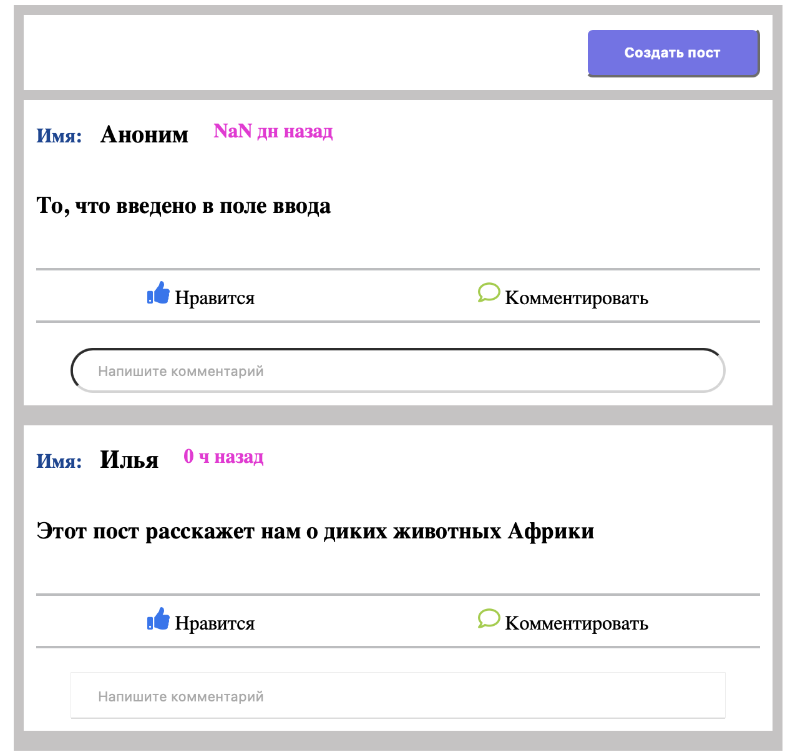
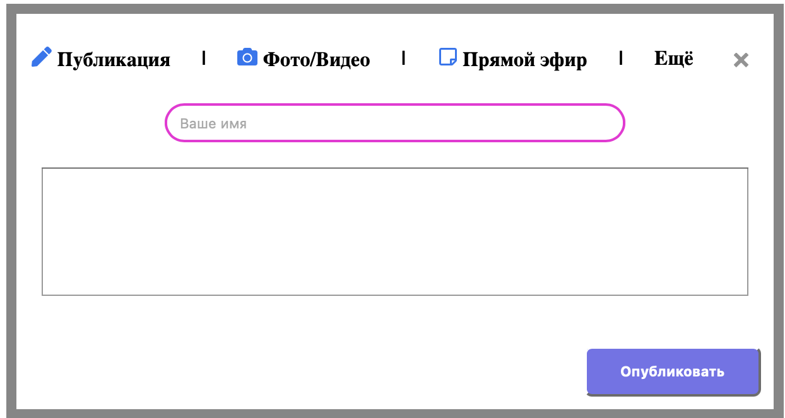
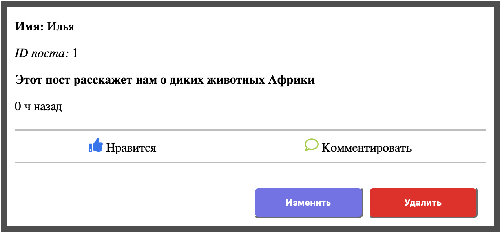
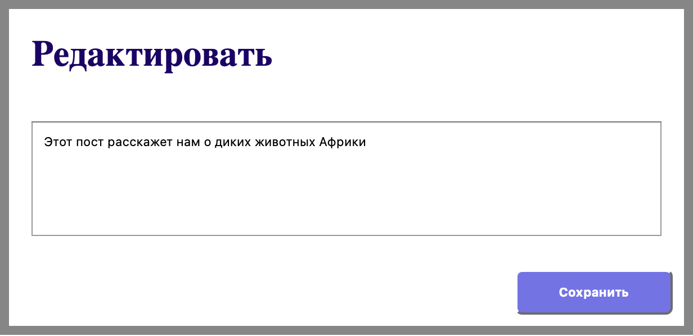

## Available Scripts

In the project directory, you can run:

### `npm start`
### `npm test`
### `npm run build`
# React Posts CRUD App

A React application for creating, viewing, editing, and deleting posts.  
The project demonstrates working with HTTP requests, React Router, custom hooks, and backend integration.



## Features

- Create new posts
- View list of posts
- Open detailed post page
- Edit existing posts
- Delete posts
- Handle loading state
- Handle request errors
- Work with a custom `useJsonFetch` hook
- Connect frontend with backend API

## Tech Stack

**Frontend**

- React
- React Router
- Custom Hooks
- Fetch API
- JavaScript
- CSS

**Backend**

- Node.js
- Express
- REST API

**Deployment**

- Vercel
- Render

## Architecture

Frontend is deployed on Vercel.  
Backend API is deployed on Render.

The frontend sends HTTP requests to the backend API and displays the received data in the interface.

## Live Demo

Frontend:  
https://router-crud-2jpf.vercel.app

Backend API:  
https://router-crud-ykg3.onrender.com

## Screenshots

### Empty posts list



### Create post


### Posts list


### Post details



### Edit post



## Installation

Clone the repository:

```bash
git clone https://github.com/IlyaDuzhakov/router_crud.git

